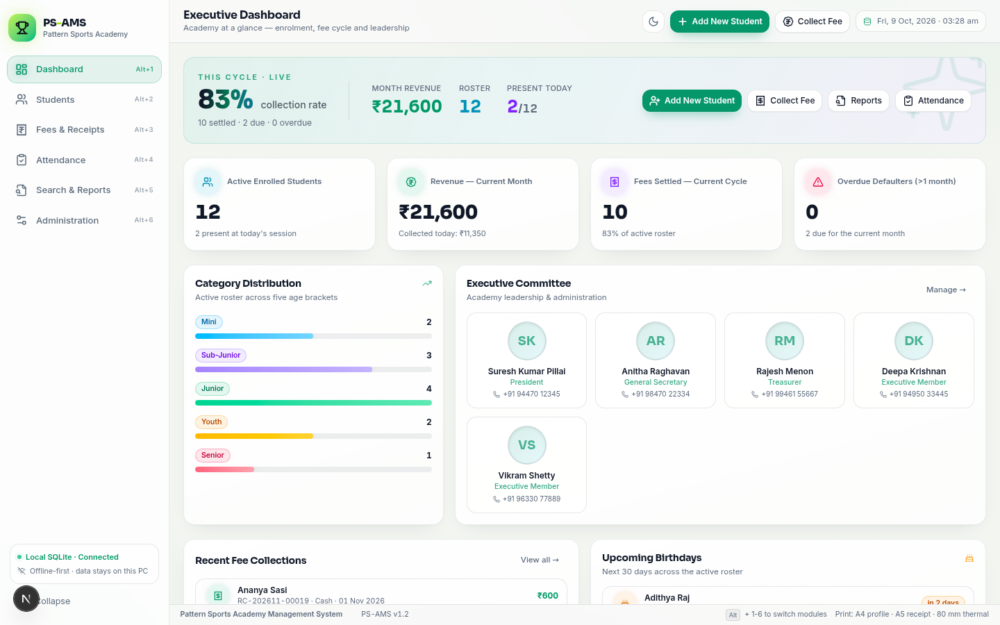
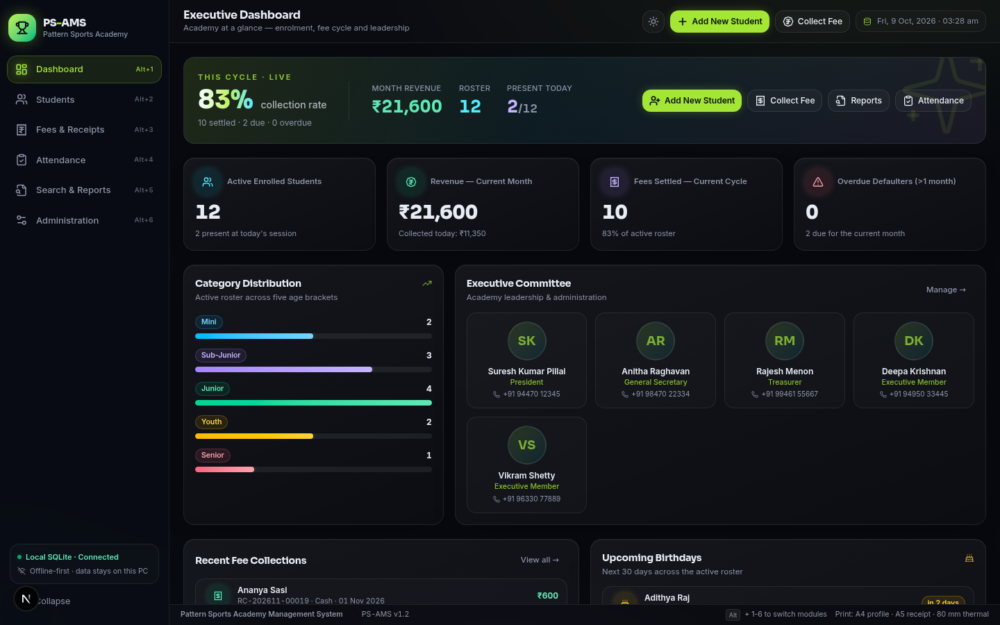
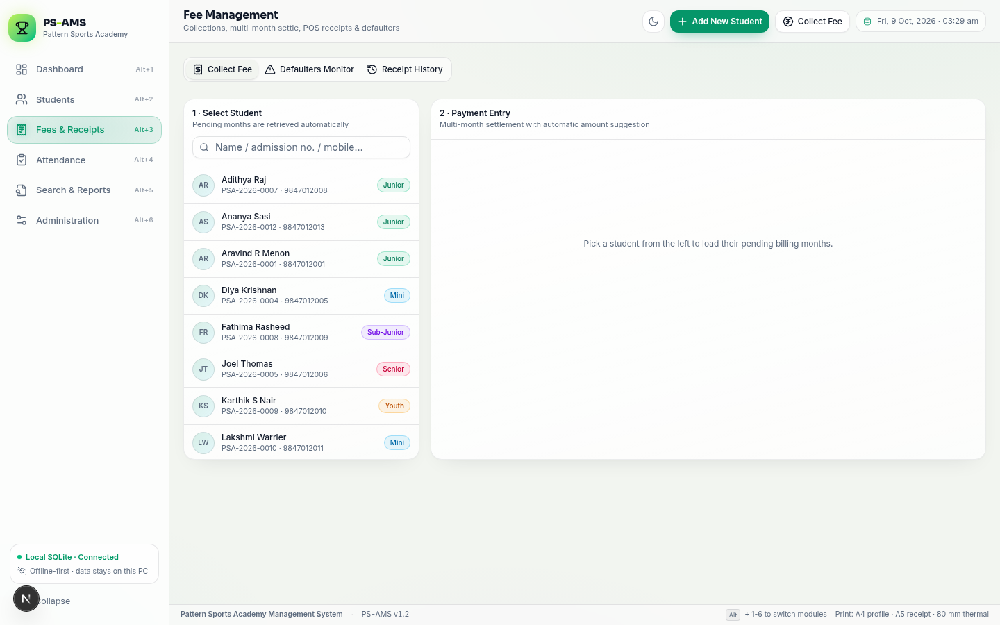
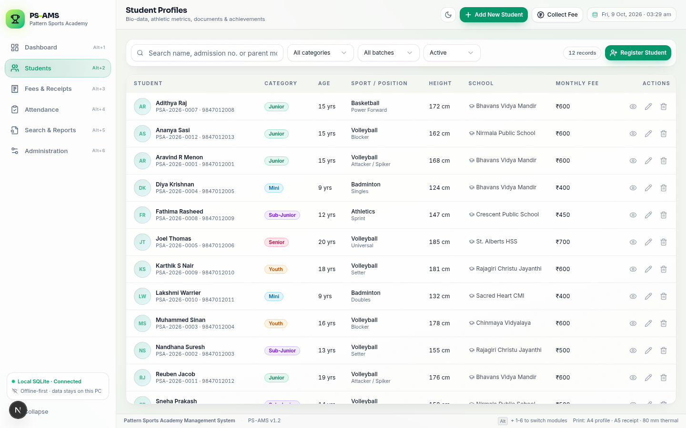
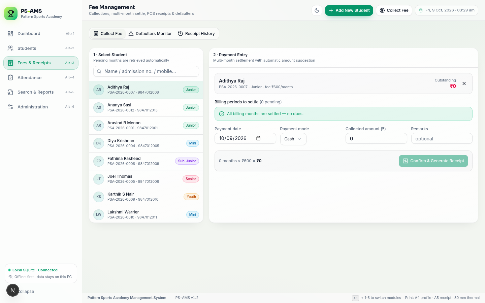
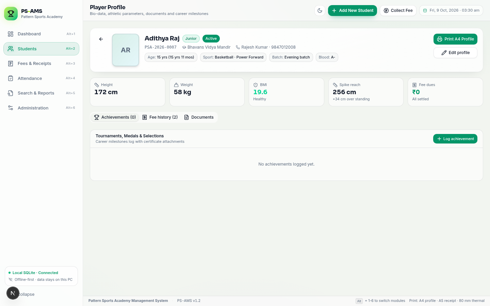

# PS-AMS — Pattern Sports Academy Management System

Offline-first academy management suite for sports academies: student records with live age/BMI profiling, POS-style fee collection with dual-format receipts, defaulter monitoring, committee governance, daily attendance, and letterhead reporting. The project ships as a **Next.js 16 single-page application** plus a **Tauri v2 packaging kit** that compiles the same UI into a Windows 10/11 `.exe` installer (NSIS/MSI) and a **portable no-install edition**.

No cloud. No accounts. All data stays in a local SQLite database with media on disk, and the app backs itself up automatically every time it exits.

## Themes & UI

The UI ships with the **light "Watermelon Sorbet" theme by default** (porcelain surfaces, watermelon-rose primary `#EF476F`, sunlit amber `#FFD166` spike accent, mint-teal `#06D6A0` highlights on an always-dark navy `#073B4C` patterned sidebar) and an optional **dark court mode** (glowing watermelon on deep navy ink). Switch anytime with the sun/moon toggle in the header — the choice is remembered across sessions and even recolours the native window title bar. A branded volleyball splash screen opens the app: bouncing match ball, perspective court floor and glowing net. Every surface keeps the modern interaction language: hover lift + glow on cards, animated page transitions, springy micro-interactions, shimmer skeletons and accent-rail row hovers — on an upsized typographic scale (17.5px base).

## Feature Map

| Module | Highlights |
|---|---|
| Executive Dashboard | Live metric cards (enrolment, five age categories, paid vs due this month, monthly revenue with count-up animation), committee showcase, quick actions |
| Student Profiles | Auto-generated admission numbers, registration date picker, live age and BMI calculation, height/weight, standing/spike/jump reach stats, sport & field position, photo and document uploads (photos, birth certificate, school/government ID), achievements log with medals, selection levels and certificate attachments |
| Fees & POS | Student lookup brings up pending months and dues, multi-month combined collection with OVERDUE chips, Cash / UPI-GPay / Bank Transfer, dual-format receipts (A5 formal with signature strip + 80 mm thermal POS slip), WhatsApp receipt dispatch over a linked device (QR pairing, one click, no WhatsApp Web), defaulter monitor that flags students overdue by more than one month, search + category/gender filters on the monitoring and history tabs, export to Print / Excel / PDF |
| Search & Reports | Real-time search (name / admission no / parent phone), multi-parameter filter engine (age range, height threshold, age category, school, sport, field position, training batch, status), formal letterhead report on A4, Excel (.xlsx) and PDF output |
| Committee | Add, edit, reorder and remove members; changes sync live to the dashboard showcase |
| Attendance | Daily roster segmented by batch/age category with rapid Present / Absent toggles, whole-batch all-or-nothing upsert, printable attendance sheet |
| Administration | Academy profile used on letterheads and receipts, real data-location readout (Rust `data_paths` on desktop / `DATABASE_URL` file on web), backup controls — one-click full database backup (`backup_now`), JSON snapshot export, staged database restore with a restart handshake, configurable backup folder (written to `ps-ams-backup-target.txt` next to the database) — plus exit auto-backup (database + media to the local folder or a remembered USB drive) and demo-data load/remove |

## Screenshots

Captured during end-to-end verification (all flows exercised in a real browser). Recent captures in the light default theme:

| | |
|---|---|
|  |  |
|  |  |
|  |  |

The full set of 18 verification captures lives in [`docs/screenshots/`](docs/screenshots/).

## Architecture

```
patterns-sports/
├── src/
│   ├── app/                        # Next.js app router
│   │   ├── api/                    # students, achievements, fees, payments,
│   │   │                           # defaulters, committee, attendance,
│   │   │                           # dashboard, settings, media, backup
│   │   └── page.tsx                # PS-AMS application entry (single-route SPA)
│   ├── components/
│   │   ├── psams/                  # app shell, module views, student drawer,
│   │   │                           # media upload, print root, count-up
│   │   └── ui/                     # shadcn/radix primitives
│   ├── hooks/
│   └── lib/
│       ├── psams/                  # domain engine (age/BMI/billing ledger),
│       │                           # api client, zustand store, export pipelines
│       └── utils.ts
├── prisma/schema.prisma            # Student, Achievement, FeePayment,
│                                   # CommitteeMember, Attendance, Setting
├── scripts/seed.ts                 # realistic demo dataset
├── scripts/check-parity.mjs        # prisma ↔ schema.sql ↔ bootstrap.ts DDL ↔ API surface
├── whatsapp-bot/                   # native Rust WhatsApp sidecar (linked devices,
│                                   # NDJSON stdio bridge, wa-store.db session)
├── src-tauri/                      # Tauri v2 shell: tauri.conf.json, Cargo.toml,
│                                   # capabilities, icons; shell logic lives in
│                                   # src-tauri/src/lib.rs (data-dir bootstrap,
│                                   # backup-on-exit, restore + WhatsApp commands)
│   └── resources/schema.sql        # canonical SQLite DDL (indexes + FK cascades)
├── docs/
│   ├── PORTING_GUIDE.md            # desktop build & porting guide
│   └── screenshots/                # end-to-end verification captures
```

### Tech stack

- **Frontend**: Next.js 16, React 19, TypeScript, Tailwind CSS 4, shadcn/ui (Radix), Framer Motion, lucide-react
- **Domain engine**: `src/lib/psams/domain.ts` — live age (years + months), BMI with health bands, age-category suggestion (Mini U-10, Sub-Junior 10–12, Junior 13–15, Youth 16–18, Senior 19+), billing-month ledger (registration month complimentary), defaulter rule (>1 month overdue), admission/receipt numbering, INR/date formatting, media path sanitisation with traversal guard
- **Database**: SQLite via Prisma (indexes and FK cascades defined in `prisma/schema.prisma`, mirrored in `src-tauri/resources/schema.sql` and in the boot-time DDL of `src/lib/psams/bootstrap.ts` — `npm run check:parity` fails when ANY of the three copies drift apart)
- **Media policy**: photos, documents and certificates are stored **on disk** under `media/` (photos / documents / certificates); the database keeps sanitised relative paths only — never BLOBs
- **Exports**: ExcelJS (.xlsx with letterhead sheet), PapaParse (CSV), jsPDF + AutoTable (PDF), CSS `@media print` pipeline for A4/A5/80 mm output
- **Desktop kit**: Tauri v2 (Rust host with sql/dialog/fs/shell plugins, WebView2 bootstrapper, NSIS + MSI bundle targets)

## Quick Start (Web Preview)

Prerequisites: Node.js 18+ (or Bun 1.x). No external database server needed — Prisma uses a local SQLite file.

```bash
git clone https://github.com/kuttappu507/patterns-sports.git
cd patterns-sports
npm install                # or: bun install
cp .env.example .env       # adjust DATABASE_URL if you like
npx prisma db push         # creates the SQLite database from the schema
bun run scripts/seed.ts    # optional demo data (or: npx tsx scripts/seed.ts)
npm run dev                # http://localhost:3000
```

The seeder populates 12 students across all five age categories, 20 fee payments producing a realistic paid/due/defaulter mix, 8 achievements, 36 attendance records, 5 committee members and academy settings.

Quality gates (also enforced in CI by `.github/workflows/verify.yml` on every
push and pull request): `npm run verify` runs ESLint, `tsc --noEmit`, the
Vitest domain-suite (`npm test`) and the backend parity check
(`npm run check:parity` — Prisma schema ↔ Tauri `schema.sql` ↔ bootstrap.ts
DDL ↔ API surface).

### Engine-free Prisma (driver adapter)

The web backend runs Prisma through the **libsql driver adapter** with the WASM
query compiler (`engineType = "client"` in `prisma/schema.prisma`), so **no Rust
engine binaries are ever downloaded** — everything needed ships in npm packages.
`prisma.config.ts` wires the CLI (`generate`, `db push`) to the same adapter.
The SQLite schema can always be recreated from the mirrored DDL at
`src-tauri/resources/schema.sql` if you prefer to skip `prisma db push`.

## Windows Desktop Build (Tauri v2)

The desktop app is a fully offline build of the same UI: SQLite through the
Tauri SQL plugin, media on disk through the FS plugin, and automatic
backup-on-exit handled by the Rust shell. No component changes are needed —
`src/lib/psams/api.ts` detects the runtime and switches between the HTTP API
and the offline backend.

### GitHub Actions (recommended)

`.github/workflows/build-exe.yml` builds the Windows installers automatically
on every push to `main`:

1. Open the repository's **Actions** tab and select **Build Windows EXE (PS-AMS)**.
2. Download the `PS-AMS-windows-installers` artifact (NSIS `.exe` + MSI + portable zip).
3. To publish all deliverables as a GitHub Release, push a version tag:

   ```bash
   git tag v1.2.1 && git push origin v1.2.1
   ```

### Portable edition (no installation)

The portable zip from the release (`PS-AMS_v*_portable_x64.zip`) contains just
`PS-AMS.exe`, a `portable.flag` marker and a README. Unzip anywhere writable
(Desktop, `D:\`, USB stick) and double-click `PS-AMS.exe` — no installer, no
admin rights. Media files and backups are created inside `PS-AMS-Data\` next
to the exe; the database is mirrored into `PS-AMS-Data\backups\` on every exit.

### If the app ever fails to open

Every boot step (and any panic) is written to a log file:

- installed: `%LOCALAPPDATA%\PS-AMS\boot.log`
- portable: `PS-AMS-Data\boot.log`

The build statically links the VC++ runtime, forces the WebView2 user-data
folder into a writable location and applies the database schema from an
embedded copy — the three classic causes of "installed but never opens" on
Windows are all engineered out. If you still see a problem, share the last
lines of `boot.log`.

### Build locally on Windows

Prerequisites: Rust toolchain (`rustup`), Node/Bun, WebView2 runtime
(auto-installed by the embedded bootstrapper in the installer).

```bash
bun install
bun run tauri dev     # smoke test in a native window
bun run tauri build   # release NSIS installer + MSI
```

Installers land in `src-tauri/target/release/bundle/{nsis,msi}/`. The
frontend is compiled as a static export (`npm run build:tauri`), and the Rust
host (`src-tauri/src/lib.rs`) bootstraps the data folder, applies
`src-tauri/resources/schema.sql` on first run, and on every app exit copies
the database (with WAL sidecars) plus the whole media tree into the backups
folder — or to a remembered USB drive when its path is written into
`ps-ams-backup-target.txt` next to the database (Settings → Data Safety →
Backup folder…). The same screen can run `backup_now` immediately and stage a
database restore from any `ps-ams-*.db` backup (applied on the next start).
See [`docs/PORTING_GUIDE.md`](docs/PORTING_GUIDE.md) for the full guide.

## Security (read this before exposing the web app)

> ⚠️ **The web API (`/api/*`) has no authentication by default. It is
> designed to run on loopback only — same machine, same user.**

- **Desktop (Tauri) build**: no HTTP server exists at all; the UI talks to
  SQLite/filesystem plugins directly. Nothing to expose.
- **Web preview/dev (`bun run dev`)**: Next.js binds `0.0.0.0`, so the dev
  server is reachable from your LAN. On untrusted networks, firewall the port
  or enable the API token (below).
- **Web production (`bun start`)**: the start script sets `HOSTNAME=localhost`,
  so the standalone server only accepts loopback connections. Remove that
  variable only if you deliberately want LAN access.
- **Opt-in API token**: set **both** `PSAMS_API_TOKEN` and
  `NEXT_PUBLIC_PSAMS_API_TOKEN` (see `.env.example`) to require a token on
  every `/api/*` request. The bundled client sends it automatically
  (`x-psams-token` header, `?token=` for media URLs); other clients must send
  the header or query parameter themselves. With no token configured, any
  process/host that can reach the port has full read-write access to the API.

## Fee & Billing Rules (the ONE set of financial rules)

These are product-policy decisions (audit report §6, adopted 2026-10) implemented by the shared
engine in `src/lib/psams/domain.ts` and enforced identically by the web API and the desktop backend:

- **Billing month** — billing starts the month AFTER registration; the joining month is complimentary.
- **Defaulter** — overdue by MORE than one billing month (2+ unpaid older cycles).
- **One receipt per month** — every settled `(student, billing month)` gets a row in the
  `PaymentMonth` allocation ledger with `UNIQUE(studentId, month)`. A concurrent double-collect is
  rejected by SQLite itself (HTTP 409 / a "month already settled" error), not just by app logic
  (audit PS-001). Legacy receipts are backfilled automatically; historical double-bookings, if any,
  are reported at boot — never rewritten.
- **Arrears pricing (Q1a)** — outstanding months are valued at the student's CURRENT monthly fee
  when read/collected. The academy re-prices old arrears after a fee change; receipts keep the
  amount actually collected. (A per-month `feeAtAccrual` history would be a deliberate future feature.)
- **Zero-fee / waiver students (Q3a)** — `monthlyFee ≤ 0` means permanently settled: never "due",
  never a defaulter, never reminded. Collecting from a zero-fee student is rejected.
- **Billing window (Q6a)** — months before the joining month or in the future are rejected;
  receipt dates must be real calendar days, not before registration and not in the future;
  payment mode is restricted to `Cash | UPI / GPay | Bank Transfer` (audit PS-008).
- **Money precision (Q7a)** — amounts are stored as REAL and compared with a half-rupee float
  tolerance; every aggregate is rounded (audit PS-009).
- **Deletion policy (Q2a)** — a student with fee receipts can NOT be hard-deleted (HTTP 409 /
  "set status to Alumni"); the database-level FK is `ON DELETE RESTRICT` on fresh databases.
  Only students with zero financial history can be deleted, and their media files are unlinked.

## Data & Safety

- **Local-first storage**: everything lives in SQLite; media files live on disk with traversal-guarded relative paths in the database.
- **Exit backup**: database + media mirrored automatically when the window closes (desktop build), into the default backups folder or a remembered USB drive.
- **Backup now (desktop)**: the Settings → Data Safety button invokes the Rust `backup_now` command — a real copy of `ps-ams-*.db` (with WAL sidecars) plus the media tree, and the toast names the folder it wrote.
- **JSON snapshot**: `GET /api/backup` (web) or the "Download JSON snapshot" button returns a full JSON manifest of all records for external archiving. It is a data snapshot — the database-file backup is the desktop `backup_now` path.
- **Restore (desktop)**: pick a `ps-ams-*.db` backup in Settings → Data Safety → Restore from backup… — the file is validated (SQLite header), staged next to the database and swapped in on the next start (the current database is kept as `ps-ams.pre-restore.db`).
- **Print pipeline**: A4 player profile card, A5 formal receipt, 80 mm thermal POS slip, rosters and reports all render through an isolated print root; app chrome is suppressed via `@media print`, and "Save as PDF" works through the same dialog.

## License

MIT — see [LICENSE](LICENSE).
