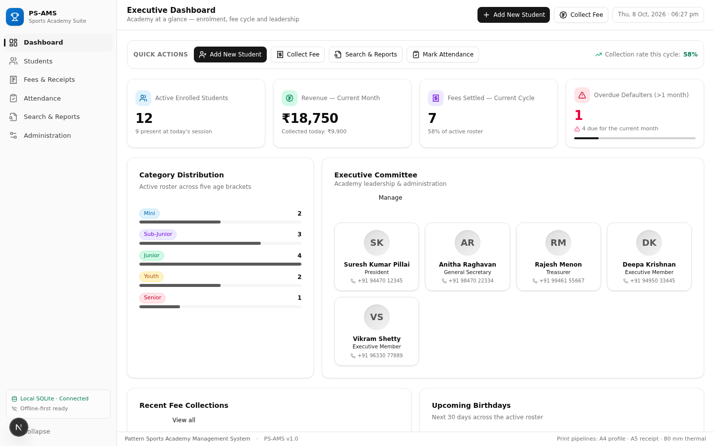
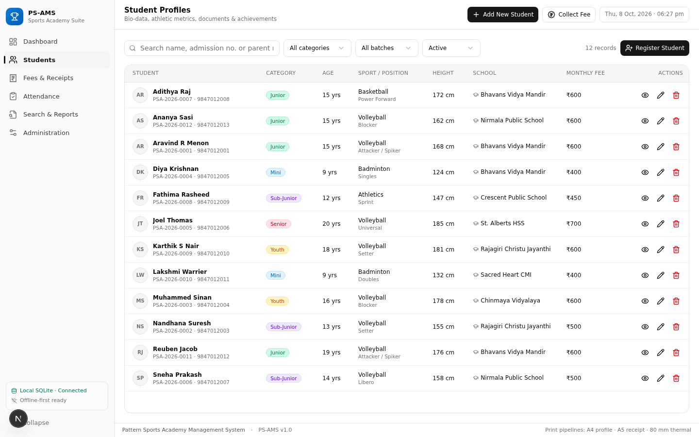
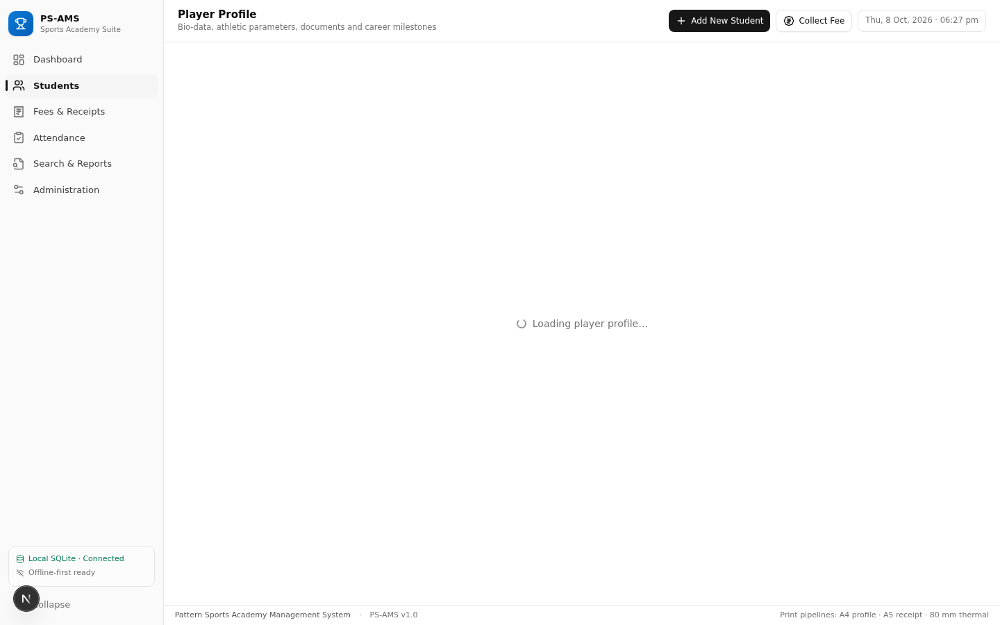
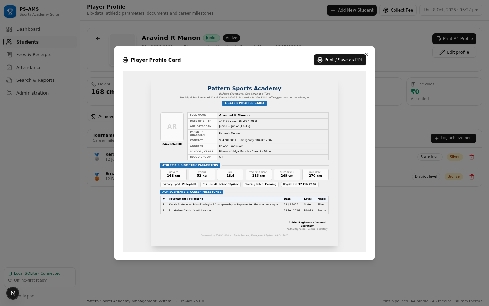
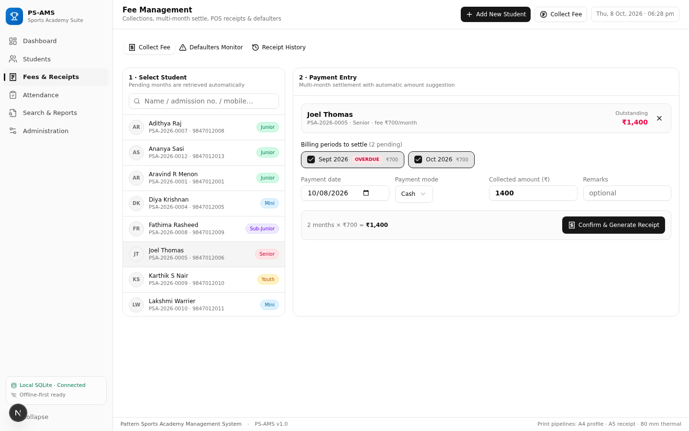
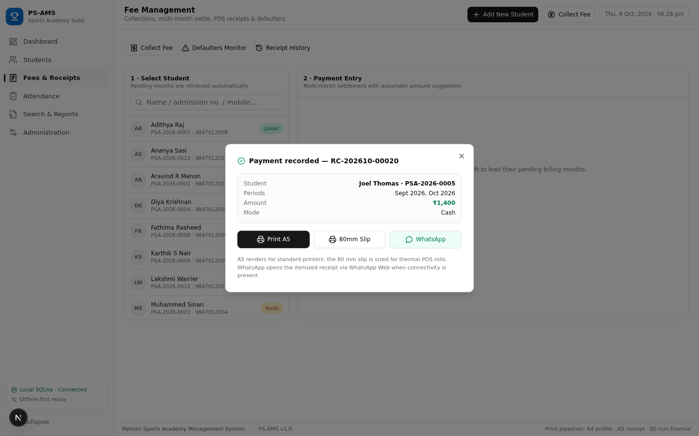
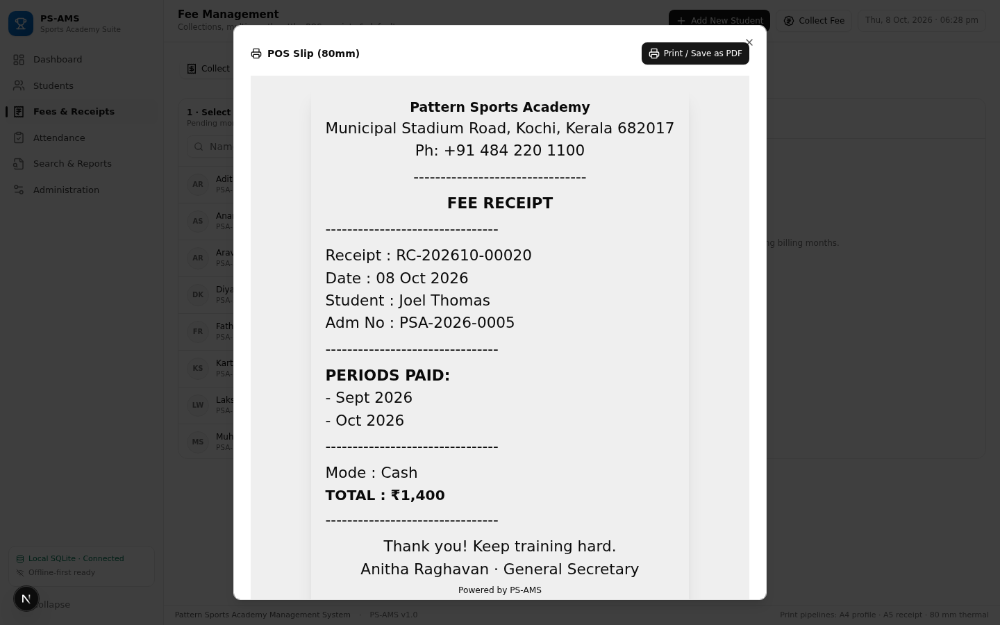
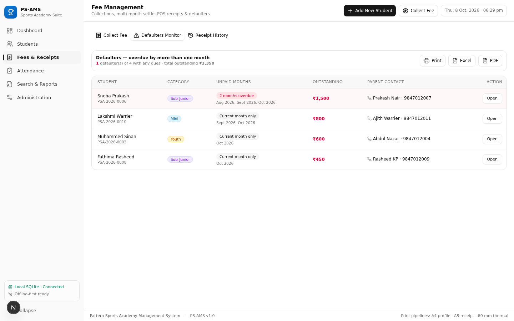
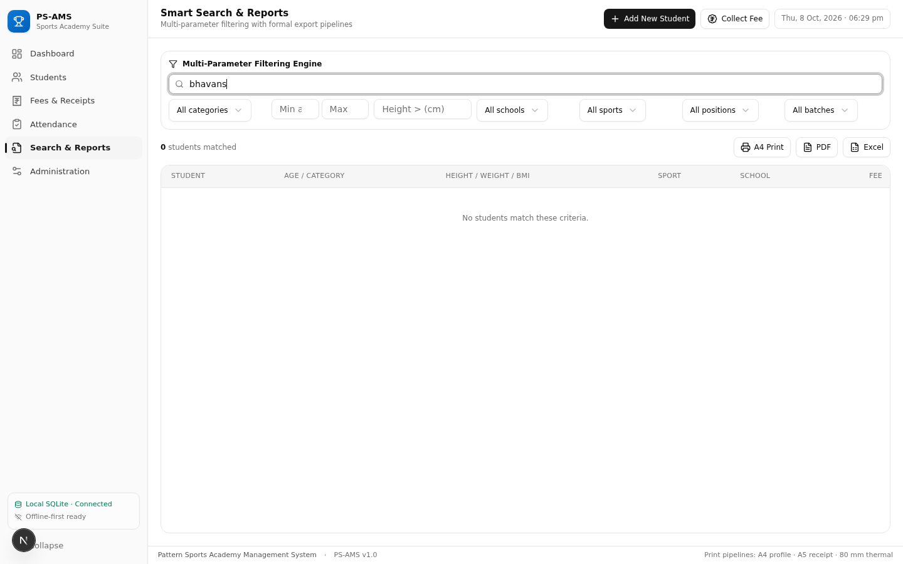
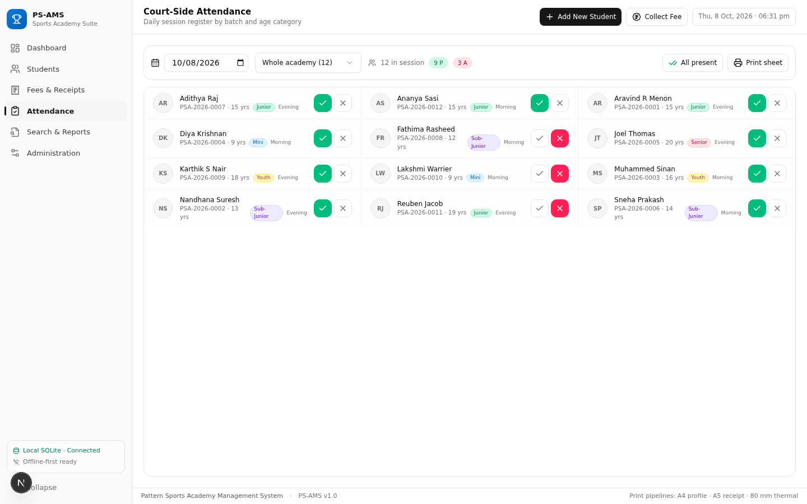

# PS-AMS — Pattern Sports Academy Management System

Offline-first academy management suite for sports academies: student records with live age/BMI profiling, POS-style fee collection with dual-format receipts, defaulter monitoring, committee governance, daily attendance, and letterhead reporting. The project ships as a **Next.js 16 single-page application** plus a **Tauri v2 packaging kit** that compiles the same UI into a Windows 10/11 `.exe` installer (NSIS/MSI).

No cloud. No accounts. All data stays in a local SQLite database with media on disk, and the app backs itself up automatically every time it exits.

## Feature Map

| Module | Highlights |
|---|---|
| Executive Dashboard | Live metric cards (enrolment, five age categories, paid vs due this month, monthly revenue with count-up animation), committee showcase, quick actions |
| Student Profiles | Auto-generated admission numbers, registration date picker, live age and BMI calculation, height/weight, standing/spike/jump reach stats, sport & field position, photo and document uploads (photos, birth certificate, school/government ID), achievements log with medals, selection levels and certificate attachments |
| Fees & POS | Student lookup brings up pending months and dues, multi-month combined collection with OVERDUE chips, Cash / UPI-GPay / Bank Transfer, dual-format receipts (A5 formal with signature strip + 80 mm thermal POS slip), WhatsApp receipt dispatch, defaulter monitor that flags students overdue by more than one month, export to Print / Excel / PDF |
| Search & Reports | Real-time search (name / admission no / parent phone), multi-parameter filter engine (age range, height threshold, age category, school, field position, gender, status), formal letterhead report on A4, Excel (.xlsx) and PDF output |
| Committee | Add, edit, reorder and remove members; changes sync live to the dashboard showcase |
| Attendance | Daily roster segmented by batch/age category with rapid Present / Absent / Late / Excused toggles, bulk upsert, printable attendance sheet |
| Administration | Academy profile used on letterheads and receipts, data-safety overview, backup controls, exit auto-backup (database + media to a local folder or a remembered USB drive) |

## Screenshots

Captured during end-to-end verification (all flows exercised in a real browser):

| | |
|---|---|
|  |  |
|  |  |
|  |  |
|  |  |
|  |  |

The full set of 18 verification captures lives in [`docs/screenshots/`](docs/screenshots/).

## Architecture

```
patterns-sports/
├── src/
│   ├── app/                        # Next.js app router
│   │   ├── api/                    # students, achievements, fees, payments,
│   │   │                           # defaulters, committee, attendance,
│   │   │                           # dashboard, settings, media, backup
│   │   └── page.tsx                # PS-AMS application entry (single-route SPA)
│   ├── components/
│   │   ├── psams/                  # app shell, module views, student drawer,
│   │   │                           # media upload, print root, count-up
│   │   └── ui/                     # shadcn/radix primitives
│   ├── hooks/
│   └── lib/
│       ├── psams/                  # domain engine (age/BMI/billing ledger),
│       │                           # api client, zustand store, export pipelines
│       └── utils.ts
├── prisma/schema.prisma            # Student, Achievement, FeePayment,
│                                   # CommitteeMember, Attendance, Setting
├── scripts/seed.ts                 # realistic demo dataset
├── src-tauri/                      # Tauri v2 shell: tauri.conf.json, Cargo.toml,
│                                   # capabilities, icons, main.rs (data-dir
│                                   # bootstrap + backup-on-exit + commands)
│   └── resources/schema.sql        # canonical SQLite DDL (indexes + FK cascades)
├── docs/
│   ├── PORTING_GUIDE.md            # desktop build & porting guide
│   └── screenshots/                # end-to-end verification captures
```

### Tech stack

- **Frontend**: Next.js 16, React 19, TypeScript, Tailwind CSS 4, shadcn/ui (Radix), Framer Motion, lucide-react
- **Domain engine**: `src/lib/psams/domain.ts` — live age (years + months), BMI with health bands, age-category suggestion (Mini U-10, Sub-Junior 10–12, Junior 13–15, Youth 16–18, Senior 19+), billing-month ledger (registration month complimentary), defaulter rule (>1 month overdue), admission/receipt numbering, INR/date formatting, media path sanitisation with traversal guard
- **Database**: SQLite via Prisma (indexes and FK cascades defined in `prisma/schema.prisma`, mirrored in `tauri/database/schema.sql`)
- **Media policy**: photos, documents and certificates are stored **on disk** under `media/` (photos / documents / certificates); the database keeps sanitised relative paths only — never BLOBs
- **Exports**: ExcelJS (.xlsx with letterhead sheet), PapaParse (CSV), jsPDF + AutoTable (PDF), CSS `@media print` pipeline for A4/A5/80 mm output
- **Desktop kit**: Tauri v2 (Rust host with sql/dialog/fs/shell plugins, WebView2 bootstrapper, NSIS + MSI bundle targets)

## Quick Start (Web Preview)

Prerequisites: Node.js 18+ (or Bun 1.x). No external database server needed — Prisma uses a local SQLite file.

```bash
git clone https://github.com/kuttappu507/patterns-sports.git
cd patterns-sports
npm install                # or: bun install
cp .env.example .env       # adjust DATABASE_URL if you like
npx prisma db push         # creates the SQLite database from the schema
bun run scripts/seed.ts    # optional demo data (or: npx tsx scripts/seed.ts)
npm run dev                # http://localhost:3000
```

The seeder populates 12 students across all five age categories, 20 fee payments producing a realistic paid/due/defaulter mix, 8 achievements, 36 attendance records, 5 committee members and academy settings.

## Windows Desktop Build (Tauri v2)

The desktop app is a fully offline build of the same UI: SQLite through the
Tauri SQL plugin, media on disk through the FS plugin, and automatic
backup-on-exit handled by the Rust shell. No component changes are needed —
`src/lib/psams/api.ts` detects the runtime and switches between the HTTP API
and the offline backend.

### GitHub Actions (recommended)

`.github/workflows/build-exe.yml` builds the Windows installers automatically
on every push to `main`:

1. Open the repository's **Actions** tab and select **Build Windows EXE (PS-AMS)**.
2. Download the `PS-AMS-windows-installers` artifact (NSIS `.exe` + MSI).
3. To publish installers as a GitHub Release, push a version tag:

   ```bash
   git tag v1.0.0 && git push origin v1.0.0
   ```

### Build locally on Windows

Prerequisites: Rust toolchain (`rustup`), Node/Bun, WebView2 runtime
(auto-installed by the embedded bootstrapper in the installer).

```bash
bun install
bun run tauri dev     # smoke test in a native window
bun run tauri build   # release NSIS installer + MSI
```

Installers land in `src-tauri/target/release/bundle/{nsis,msi}/`. The
frontend is compiled as a static export (`npm run build:tauri`), and the Rust
host (`src-tauri/src/main.rs`) bootstraps the data folder, applies
`src-tauri/resources/schema.sql` on first run, and on every app exit copies
the database (with WAL sidecars) plus the whole media tree into the backups
folder — or to a remembered USB drive when its path is written into
`ps-ams-backup-target.txt` next to the database. See
[`docs/PORTING_GUIDE.md`](docs/PORTING_GUIDE.md) for the full guide.

## Data & Safety

- **Local-first storage**: everything lives in SQLite; media files live on disk with traversal-guarded relative paths in the database.
- **Exit backup**: database + media mirrored automatically when the window closes (desktop build), with a timestamped folder per run.
- **Snapshot API**: `GET /api/backup` returns a full JSON manifest of all records for external archiving.
- **Print pipeline**: A4 player profile card, A5 formal receipt, 80 mm thermal POS slip, rosters and reports all render through an isolated print root; app chrome is suppressed via `@media print`, and "Save as PDF" works through the same dialog.

## License

MIT — see [LICENSE](LICENSE).
